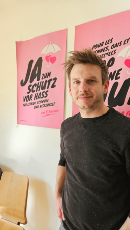

+++
title = "Die Gay Community der Schweiz darf endlich heiraten, hat sie jetzt alles erreicht?"
date = "2024-05-27"
draft = false
pinned = false
tags = ["LGBTQAI", "Queer", "Pride", "Gesellschaft"]
image = "viviana-couto-sayalero-ccie19huu4-unsplash.jpg"
+++
Der Kampf um Gerechtigkeit geht weiter. Seit Jahrzehnten lässt sich die LGBTQAI+ Community weltweit in ihrem Protest gegen Diskriminierung nicht unterkriegen, doch die Gesellschaft um sie herum macht es ihnen nicht immer leicht. Auch im Kanton Bern und in der ganzen Schweiz müssen sich queere Menschen mit ihrem Alltag auseinandersetzen, obwohl die Schweiz, vor allem nach der Annahme der Initiative Ehe für alle, in diesem Bereich eigentlich einen guten Ruf hat.



Im September 2021 wurde unteranderem für die 'Ehe für Alle' - Initiative im Parlament abgestimmt. Mit sich brachte diese Initiative das Ziel, die Heirat für gleichgeschlechtige Paare schweizweit zu legalisieren, sowie den Zugang zu Adoption und der Samenspende. Nach einer klaren Übereinstimmung der Stimmberechtigten wurde die Ehe für Alle bei der Volksabstimmung vom 26. September 2021 angenommen. Gleichgeschlechtige Paare konnten folglich ab dem 1. Juli 2022 heiraten, oder ihre eingetragene Partnerschaft in eine Ehe umwandeln. Eine Organisation, die diese Initiative schon Jahrzehntelang in Kraft setzen wollte, ist Pink Cross, die nationale Dachorganisation für schwule und bisexuelle Männer. 



Auf der Monbijoustrasse rattert ein Tram vorbei, ein kurzer, aber heftiger Windstoß. Es ist ein warmer, sonniger Tag und ich bin auf dem Weg zu Roman Heggli, dem Geschäftsleiter von Pink Cross, der Schweizer Dachorganisation für schwule und bisexuelle Männer. Auf der bunt geschmückten Fensterbank des Pink-Cross-Büros flattern Regenbogenfähnchen im Wind und lächeln auf den Gehsteig. Das Büro von Pink Cross ist klein und bescheiden. Roman empfängt mich am Eingang und führt mich in einen kleinen Besprechungsraum mit einem Tisch und Stühlen in der Mitte. An den Wänden hängen Plakate von Initiativen und Flyer. Im Fenster sieht man wieder die wehenden Regenbogenfahnen. Roman schildert seine Gefühle und Wahrnehmungen bezüglich der LGBTQAI+ Akzeptanz in Bern. 

Die Dachorganisation Pink Cross ist die nationale Interessenvertretung der Schwulen und Bisexuellen Männer in der Schweiz. Mit seinen 2500 Einzelmitgliedern und angeschlossenen Organisationen setzt sich Pink Cross seit 31 Jahren für die Gay-Community in der Schweiz ein, sei es auf politischer oder gesellschaftlicher Ebene. Ihr Ziel - die Verbesserung der rechtlichen und gesellschaftlichen Akzeptanz von Homosexuellen. Seit der Gründung setzt sich Pink Cross vor allem für den Diskriminierungsschutz von Lesben, Schwulen und Bisexuellen und für die Ehe für alle ein. Die Ehe für Alle-Initiative, welche die gleichgeschlechtliche Ehe ermöglichen soll, wird nach einem harten Kampf am 26. September 2021 angenommen. 

Laut Roman Heggli ist die Akzeptanz gegenüber der LGBTQAI+ Community in der Schweiz in den letzten Jahrzehnten stark gestiegen. Seit zwei bis drei Jahren sei aber auch ein Rechtsruck spürbar, der einen Teil der Gesellschaft deutlich mitziehe. Ob im Parlament oder im Alltag, queere Menschen müssen sich vermehrt rechtfertigen und geraten dadurch im Alltag unter Druck. Diskriminierungen und Übergriffe nehmen zu, und je nach Straßenecke lässt ein schwules Paar sicherheitshalber lieber die Finger voneinander.

Aber ab dem 1. Juli 2022 darf jedes schwule und lesbische Paar heiraten, ein Riesenfortschritt in der LGBTQ+ Geschichte der Schweiz. Wie kommt es dann zu dieser sinkenden Akzeptanz? Roman Heggli erklärt, dass die negativen Stimmen in solchen Kampagnen einen sehr starken Einfluss auf die Menschen haben. Bereits queerfeindliche Meinungen werden verstärkt und ermutigen andere, ihre negativen Vorurteile zu äußern. So ist Roman Heggli der Meinung, dass die Akzeptanz nach der Initiative "Ehe für alle" deutlich abgenommen hat.

> "Der Druck muss von der Gesellschaft kommen, sonst bewegt sich die Politik nicht."
>
> Roman Heggli

Diese Intoleranz gegenüber nicht-heteronormativen Lebensweisen, die es schon immer gab, ist leider auch schwer zu bekämpfen. Um die gesellschaftliche Akzeptanz zu stärken, müssen alle an möglichst vielen Stellen ansetzen und mithelfen. Vor allem in den Schulen anzusetzen, wäre etwas Wichtiges. Noch immer fehlt ein konkreter Diskriminierungsschutz für Lesben, Schwule und Bisexuelle am Arbeitsplatz, und noch immer werden so genannte ‘Homoheilungen’ oder Konversionstherapien durchgeführt. Ziel dieser ‘Therapie’ ist es, eine Person von ihrer sexuellen Orientierung oder Geschlechtsidentität zu ‘heilen’. Das Schweizer Parlament weigert sich nach wie vor, diese Therapien landesweit zu verbieten. Solche Diskriminierungen zeigen, dass wir als Gesellschaft noch viel tun müssen, um die Akzeptanz zu verbessern.

> "Es ist die Vielfalt der Community, die nicht sichtbar ist."
>
> Roman Heggli

Queere Lebensweisen werden stark hinterfragt, und um wirklich voranzukommen, muss die Community erst wirklich sichtbar werden. In vielen Bereichen gibt es bereits zumindest schwule Vorbilder, z.B. im Profifußball. Dass es die LGBTQAI+ Community gibt, weiß mittlerweile fast jeder, aber wie vielfältig die Community sein kann, ist noch nicht allen bekannt, bedauert Roman Heggli. Es gibt einen deutlichen Mangel an Ressourcen und Zufluchtsorten für queere Menschen, vor allem für Jugendliche. Es gibt kaum Anlaufstellen für queere Jugendliche, die zum Beispiel nach einem Outing von ihrer Familie nicht akzeptiert werden. Es gibt zwar einige Initiativen wie die Milchjugend, die größte Jugendorganisation für queere Menschen, die in Bern monatliche Treffpunkte organisiert, aber ansonsten fehlt es völlig an Angeboten.

Roman wünscht sich, dass die Community in Bern aktiver wird und sich eigene Räume schafft und gestaltet, dass sie sich frei entfalten und Flagge zeigen kann. Auch von der nicht-queeren Gesellschaft wünscht er sich noch mehr Engagement und Interesse, ihre queeren Mitmenschen wirklich verstehen zu wollen, statt sie nur zu tolerieren.

Nach einiger Zeit flattern die Regenbogenflaggen immer noch vor dem Fenster, beleuchtet vom warmen Sonnenschein. Im Innern vom Pink Cross Büro ist es warm, eine Wärme die nach dem Ausgang im Treppenhaus etwas abkühlt. Das Tram rast wieder auf den Gleisen der Monbijoustrasse vorbei. Der Tag geht weiter, und so bewegt sich auch die LGBTQAI+ Community immer weiter auf ihrem Weg zur vollen Gerechtigkeit. Die Regenbogenfahnen im Fenster des Bürogebäudes sind Zeichen der Hoffnung und des fortlaufenden Kampfes. Veränderungen sind durch das Engagement vieler Menschen möglich. Um unseren Mitmenschen ein gerechtes, friedliches Leben zu ermöglichen, müssen wir zusammenhalten. Mit diesen Gedanken sieht man die Stadt und die allgemeine Gesellschaft schon in einem ganz vielfältigerem Licht.