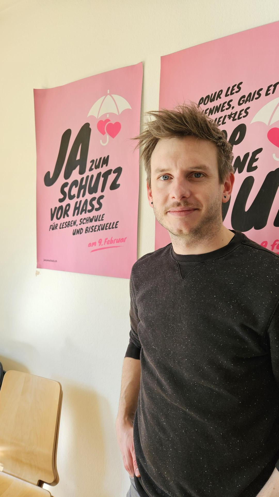

+++
title = "Nach der Ehe für Alle alles erreicht? Ein Interview mit Roman Heggli"
date = "2024-03-21"
draft = false
pinned = false
tags = ["LGBTQAI+", "Pride", "Gesellschaft"]
image = "cecilie-johnsen-g8cxfhkupdu-unsplash-1-.jpg"
description = ""
+++


Roman ist 33 Jahre alt, wohnt in Luzern und arbeitet seit 2018 in Bern als Geschäftsleiter bei Pink Cross, die Schweizer Dachorganisation für homosexuelle und bisexuelle Männer. In diesem Interview erzählt er über die allgemeine Lage bezüglich der Akzeptanz gegenüber queeren Menschen in der Schweiz, und was er sich für die Community in Zukunft wünscht.





* Name: Roman Heggli
* Alter: 33
* Wohnort: Luzern
* Beruf: Seit 2018 Geschäftsleiter bei Pink Cross



Das Büro von Pink Cross befindet sich im dritten Stock eines alten Gebäudes an der Monbijoustrasse, gleich neben der Tramstation. Es ist ein bescheidenes Büro mit mehreren Räumen, in denen Mitarbeitende von Pink Cross fleissig arbeiteten. Roman und ich sprachen in einem Besprechungsraum mit einem grossen Tisch in der Mitte. An der Wand des Zimmers hängen diverse Plakate und Flyer von Initiativen und Events. Im Stockwerk über uns musizierte jemand, was uns während unserem Gespräch aber nicht störte.

**Könnten Sie mir allgemein etwas über Pink Cross erzählen?**

Pink Cross ist der Dachverband der schwulen und bisexuellen Männer in der Schweiz, das heisst, wir sind wirklich die nationale Interessenvertretung von allen schwulen und bisexuellen Männern. Wir haben insgesamt 2500 Einzelmitglieder und einige Organisationen, die bei uns Mitglied sind. Wir engagieren uns in diversen Bereichen, vor allem in der Politik und im Bereich Gesellschaft mit dem Ziel, dass wir sowohl die rechtliche Gleichstellung erreichen und auch die gesellschaftliche Akzeptanz von uns queeren Männern verbessen können.

**Hat Pink Cross mit ihren dazugehörigen Organisationen eine bestimmte Initiative oder ein Movement unterstützt?**

Pink Cross ist jetzt gut 30 Jahre alt und die Ehe für Alle war schon seit Anfang an das grösste Thema. Bereits bei der Gründung wurde gleich eine Petition gestartet, zuerst für die eingetragene Partnerschaft für queere Menschen und inzwischen auch die Ehe für Alle. Ebenfalls haben wir auch den Diskriminierungsschutz erreicht, das heisst, wir sind jetzt tatsächlich vor Diskriminierung und vor öffentlichem Aufruf zu Hass gegen Lesben, Schwule und Bisexuelle geschützt und können uns dagegen wehren.

> "Der Druck muss von der Gesellschaft kommen, sonst bewegt sich die Politik nicht."
>
> \-Roman Heggli

**Wie hat sich Pink Cross für die Ehe für Alle beteiligt? Haben Sie Demos veranstaltet, oder Artikel veröffentlicht?**

Hey, alles mögliche, da waren wir wirklich auf jeder Ebene aktiv. Bei sowas müssen wir die Community immer informieren, sensibilisieren und mitnehmen. Wir müssen viel in die Öffentlichkeit gehen, uns zeigen, im Fernseher, auf Social Media, überall. Wir wollen zeigen, warum wir das alles brauchen und wollen, und wo das Problem liegt. Meinen Erfahrungen nach müssen wir die Leute wirklich informieren, um was es geht, wenn wir ein Anliegen haben, damit wir politisch etwas erreichen können.

**Und wie würden Sie allgemein die Situation bezüglich Akzeptanz der LGBTQAI+ Community in Bern einschätzen?**

Grundsätzlich glaube ich, dass die Akzeptanz in den letzten Jahrzehnten sehr stark gestiegen ist, und jedoch spüren wir gleichzeitig, gerade in den letzten zwei, drei Jahren, dass es auch wieder rückwärtsgehen kann. Es hat einen klaren Rechtsruck gegeben in der Gesellschaft, und das merkt man nicht nur politisch, indem wir immer mehr Mühe haben, unsere Anliegen durchs Parlament zu bringen, sondern auch gesellschaftlich. Wir müssen uns wieder stärker rechtfertigen und geraten unter Druck. Angriffe und Diskriminierung nehmen auch eher wieder zu. Das trifft auch auf Bern zu, man kann man als 2 Männer noch gut händchenhaltend durch die Strassen laufen, aber je nach Ort lässt man die Hand dann los, um nicht angegriffen zu werden. Das ist sehr schade und belastend. 

**Haben Sie das Gefühl, dass sich die Akzeptanz für die Community nach der Ehe für Alle spezifisch verschlechtert oder verbessert hat?**

Solche Abstimmungen oder Kampagnen sind immer etwas zweischneidig. Einerseits ist es mega schön, sich als queere Menschen und gleichgeschlechtige Paare sichtbar machen zu können, andererseits hört man auch stark die negativen Stimmen, welche die Leute ermutigten und dabei bestärkten, sich gegenüber queeren Menschen nicht wirklich zu öffnen. Und von daher hat, nach meinem Empfinden, die Akzeptanz nach der Ehe für Alle deutlich abgenommen. Was ich auch häufiger höre ist: "Ihr habt ja jetzt die Ehe für Alle, jetzt habt ihr alles erreicht was ihr wolltet, nun gibt doch mal Ruhe und seit zufrieden." Aber das sind wir noch nicht. Wir dürfen jetzt zwar heiraten, aber wir erleben trotzdem noch diese Diskriminierung und werden immer noch nicht vollständig akzeptiert. Vor allem non-binäre Menschen oder schwule Männer, die nicht dem Männlichkeitsklischee entsprechen, werden immer weniger akzeptiert.

**Denken Sie, es könnten irgendwelche konkrete Massnahmen ergriffen werden, um die LGBTQ+ Community von dieser Intoleranz besser zu schützen?**

Ja, wenn ich das so genau wüsste, gell, dann hätten wir es wohl schon gemacht. Also bei den Schulen ansetzen wäre auf jeden Fall etwas vom wichtigste. Wir arbeiten gerade auch an einem Zivilcourage Projekt, was wir von den Leuten auch wirklich fördern möchten. Es ist wichtig, dass wir immer wieder aufs Tapet bringen, dass wir alle brauchen und sie auch in die Verantwortung nehmen. Ausserdem braucht es auch staatliche Massnahmen, beispielsweise braucht es noch einen Diskriminierungsschutz am Arbeitsplatz für Lesben, Schwule und Bisexuelle. Und schlussendlich sind Konversionstherapien, oder Homoheilungen, mit dem Ziel, sexuelle Orientierungen oder Geschlechtsidentitäten zu heilen, immer noch erlaubt. Das zeigt, dass wir als Gesellschaft das alles immer noch als etwas komisches ansehen, und daher wird die Akzeptanz auch nicht besser.

> "Es ist die Vielfalt der Community, die nicht sichtbar ist."
>
> \-Roman Heggli

**Und wie ist es mit der Sichtbarkeit von queeren Menschen in der Politik und Medien aus der Schweiz? Denken Sie, sie werden gut repräsentiert oder wünschen Sie sich da noch mehr?**

Grundsätzlich haben wir eine grosse Sichtbarkeit in den letzten Jahren erreicht, was jetzt aber wieder deutlich abgenommen hat. Queere Lebensweisen werden mit viel Stärke in Frage gestellt, es gibt jetzt fast jeden Sonntag irgendwelche transfeindliche Artikel in den Zeitungen, diese negative Sichtbarkeit wollen wir natürlich nicht. Sonst finde ich die Repräsentanz so naja. Wir sind da, wir sind irgendwo sichtbar, inzwischen gibt es in fast allen Feldern auch wenigsten schwule Vorbilder, zum Beispiel im Profifussball. Aber es ist immer noch sehr eingeschränkt, es ist die Vielfalt der Community, die nicht sichtbar ist.

**Was denken Sie über die Repräsentation von queeren Jugendlichen in Bern? Gibt es ausreichende Unterstützungssysteme oder Ressourcen für sie?**

Nein, absolut nicht. Es gibt gute Initiativen, zum Beispiel die Milchjugend, die regelmässig einmal im Monat in Bern die Milchbar organisiert. Das finde ich mega wichtige Treffpunkte um andere queere Menschen kennenzulernen und das Selbstbewusstsein zu stärken. Für queere Jugendliche, die sich beispielsweise outen und von ihren Eltern deshalb nicht mehr akzeptiert werden, gibt es kaum Unterschlupfmöglichkeiten, wo sie schnell mal paar Wochen unterkommen könnten, um das Ganze etwas setzen zu lassen und es später wieder zu versuchen. Es fehlt einfach völlig an spezifischen Angeboten.

**Zu aller Letzt noch, haben Sie einen konkreten Wunsch an die Community in Bern oder an nicht - queere Menschen, was sie für die queere Community tun könnten?**

Ich wünsche mir, dass die Community in Bern noch ein bisschen aktiver wird und sich ihre eigenen Räume schafft und gestaltet. Von der Gesellschaft wünsche ich mir, dass sie sich wirklich aktiv für uns einsetzen, nachfragen und Interesse daran zeigen, uns verstehen zu wollen, anstatt uns einfach ignorant zu tolerieren.